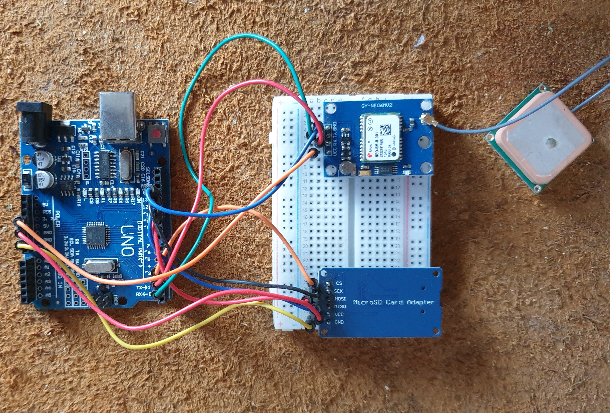
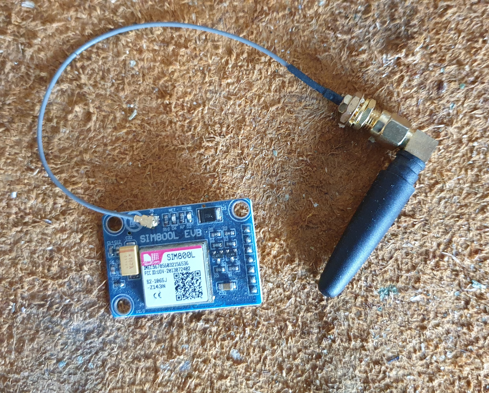
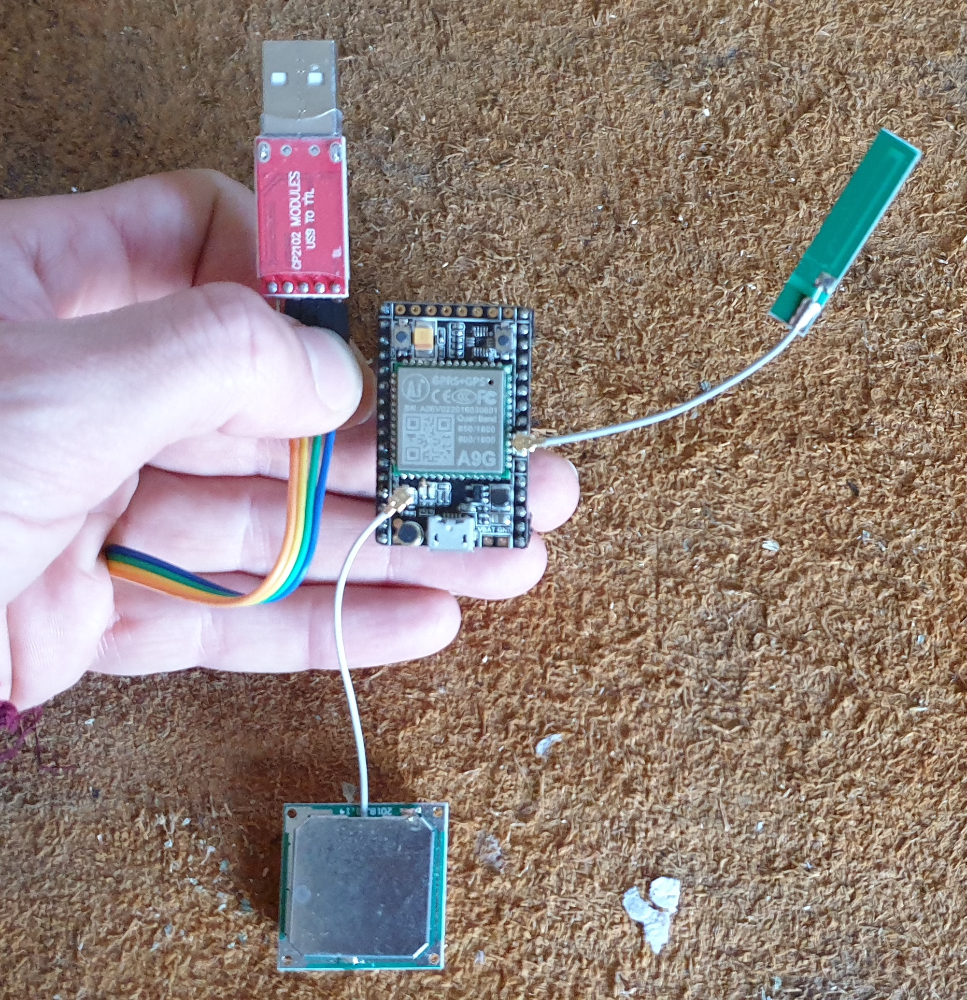

# Tracker Build 
The goal of this project is twofold.
1. Learn new languages that enable me to interface with hardware like Arduino's and Modules like GPS modules and data loggers.
2. Build a full stack website to enable people to see where I have been riding using an overlay on a map. 
To work with most of the hardware I have had to learn a rudimentary understanding of C++ as well as how many of the hardware modules actually work. 
For example, I am using the Neo-6m module that allows me to track my position based on my GPS coordinates (rather than using cell towers to triangulate my position which is possible but much less accurate). This lead me to learn about NMEA data that is being calculated in the module which inform me on things like positions but can also tell me speed, altitude, and more. 

Below you can see some of my research and pictures of the modules I have used. I had done two stages of research.
1. How does each module work 
2. How to connect and make them communicate with each other. 

### Modules
#### Arduino + Neo-6m + Data logger
Arduino linked up to the Neo-6m GPS module, the data logger module. At this part of the project, I am testing whether I can create a connection and save the NEMA strings to the data logger. This was a success though I need to work on how to store the data more cleanly as it currently creates and saves to a new file each time it is able to generate the correct NMEA string. 
To start recording data power up the module using a power sorce. There will be a constant light on the arduino board showing power is on. Once The SD card is read and the file is created or found it will start pulsing data as the set timmer. This is not saveing data to the sd card yet, this is only stating that the hardware is all working. When the light starts flashing on the neo-6 module it states that the module has connected to the satilites and has positional data. At this point it will recive a signal strenth of 1 which will start the logging part of the nema string onto the sd card.

#### Ne0-6m GPS module
The Neo-6m is my interface with the satellites. There are many really interesting things one can do with this module. 
This module produces a set of NEMA strings once it connects to three or more satellites.. 
They need three satellites. to allow triangulation to work out your position through more satellites will increase the fidelity or consistency of connection.
I am only interested in one of the strings calculated by the module: GPGLL string which only gives longitude and latitude as well

EXAMPLE STRING - $GPGGA,110617.00,41XX.XXXXX,N,00831.54761,W,1,05,2.68,129.0,M,50.1,M,,*42

    110617 – represents the time at which the fix location was taken, 11:06:17 UTC
    41XX.XXXXX,N – latitude 41 deg XX.XXXXX’ N
    00831.54761,W – Longitude 008 deg 31.54761′ W
    1 – fix quality (0 = invalid; 1= GPS fix; 2 = DGPS fix; 3 = PPS fix; 4 = Real Time Kinematic; 5 = Float RTK; 6 = estimated (dead reckoning); 7 = Manual input mode; 8 = Simulation mode)
    05 – number of satellites being tracked
    2.68 – Horizontal dilution of position
    129.0, M – Altitude, in meters above the sea level
    50.1, M – Height of geoid (mean sea level) above WGS84 ellipsoid
    empty field – time in seconds since last DGPS update
    empty field – DGPS station ID number
    *42 – the checksum data, always begins with *

The other NMEA sentences provide additional information sent from the GPS unit:

    $GPGSA – GPS DOP and active satellites - $GPGSA,A,3,06,04,17,01,19,03,22,09,,,,,2.62,1.17,2.34*01

    $GPGSV – Detailed GPS satellite information - $GPGSV,3,2,12,06,41,303,27,09,39,203,21,12,05,327,,17,39,239,20*7A

    $GPGLL – Geographic Latitude and Longitude - $GPGLL,5132.37764,N,00002.78356,W,170750.00,A,A*76

    $GPRMC – Essential GPS pvt (position, velocity, time) data - $GPRMC,170751.00,A,5132.37768,N,00002.78347,W,0.110,,240720,,,A*61

    $GPVTG – Velocity made good - $GPVTG,,T,,M,0.291,N,0.538,K,A*27
    
Strings being taken from module:
    Lat: 51.539807
    N/S: N
    Lng: -000.046281
    E/W: W
    Fix: 1
    Sats: 04
    HDP: 4.67
    Alt: 58.2
    Metres: M
    MSL: 45.5
    error
    Time: 153544.00
    
The data baing stored in the sd card is very simple. I am just taking the record number: time : longtitude: latitude:
    1,  123212.00,  51.539684,  -000.046488
    2,  123213.00,  51.539688,  -000.046481
    3,  123214.00,  51.539697,  -000.046472
    4,  123215.00,  51.539693,  -000.046473
    5,  123216.00,  51.539694,  -000.046470
    6,  123217.00,  51.539693,  -000.046467
    
    Note* one of the problems in my code is that teh count starts when the arduino is connected to both the sd card reader adn the neo-6 module. 
    If the satalites connect when it has already tried will lead to the first number being the number of pulses since started. 
    To restart the count push the button on the side ofthe power input on the arduino. 
    

#### SIM800L 
This module will be used to send the data over to the website. This will either can be done in two ways.
1. Use SMS messaging through twilio to send information over to my website.
2. Create a data connection to my server and upload information either constantly or on request. 
(constant upload would be managed but saving data with the same date, info on request would be triggered by an SMS from the website which will trigger the arduino to compress the GPS information and send it up to the server in one go)

It is possible to track yourself using this sim800l but it is based on triangulation from signal towers and due to the fidelity of information received this is not always very accurate, the position is based on signal strength and estimating distances which is why I have used the Neo-6m module which is accurate to within 1m.

This module does require a working sim card and works like a very simple mobile phone allowing me to make and receive calls and messages as well as data.
There are many different types of antena that will change the level of connection you can find in a given area.

<!-- The project has been to build a website to allow people to follow me when I go cycling. This was to be done via a webiste were the user can click a button on a page in which a google map will be rendered with my current position and previous positions saved during ride. In addition I will be building the GPS tracker from teh hardware up in order to resarch GPS, and Celular communication. You can see pictures of the project and list of hardware bwlow. -->

## Other Setups
I have played with several other types of setups to try to get to the same result. 
The AG9 module is a GPS and SIM capable module that could cut out some of the separations of modules, however, this project was not based around being super-efficient in size, power, or complexity. Instead of separating out each module and working with each individually, I am learning much more about how to communicate and handle the data for each module. 
However, this module will allow me to create a connection with a server and constantly upload my position meaning I won't need to have a data logger on the hardware side. 

